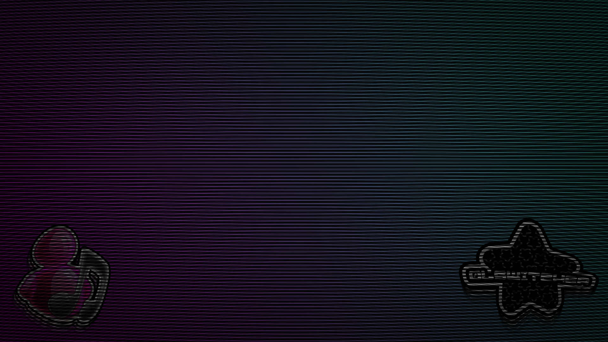

[](https://git.io/typing-svg)

> **previously known as 0lOS GRUB Theme** - *changed to match my custom nixos iso*

Forked from [shvchk's](https://github.com/shvchk) [Fallout GRUB Theme](https://github.com/shvchk/fallout-grub-theme).

Mostly just changed the background, added more icons, and updated the config (theme.txt) a bit.  

Supported languages: Chinese (simplified), Chinese (traditional), English, French, German, Hungarian, Italian, Korean, Latvian, Norwegian, Polish, Portuguese, Russian, Rusyn, Spanish, Turkish, Ukrainian

> *Just the Background*
<p align="center">
  
</p>

> *Ventoy*
<p align="center">
  
</p>

> [!NOTE]
> Icons have been somewhat inconsistent-showing up sometimes but not others depending on a variety of factors.
> More testing NTB done for this on a lot of different machines, so I will remove this disclaimer when I know it's stable.
> In the meantime, feel free to open a PR, any contributions are welcome :)

---

### Installation / update

- **Secure way:**

  - Download install script:

    ```sh
    wget -P /tmp https://github.com/0lswitcher/y2kos-grub-theme/raw/master/install.sh
    ```

  - Review it at `/tmp/install.sh`

  - Run it:

    ```sh
    bash /tmp/install.sh
    ```

- **Easier, less secure way** — just download and run install script:

  ```sh
  wget -O - https://github.com/0lswitcher/y2kos-grub-theme/raw/master/install.sh | bash
  ```

<br>

You can use `--lang` option to select language and disable interactive language selection, e.g.:

```sh
bash /tmp/install.sh --lang German
```

or

```sh
wget -O- https://github.com/0lswitcher/y2kos-grub-theme/raw/master/install.sh | bash -s -- --lang Korean
```

Full list of languages see in `INSTALLER_LANGS` variable in [install.sh](install.sh)

---

### Credit

- Shoutout to [shvck](https://github.com/shvchk) for the [Fallout GRUB Theme](https://github.com/shvchk/fallout-grub-theme) that this theme is based off of and originally forked from. You can also find it on [openDesktop](https://www.opendesktop.org/p/1230882). Show them some love!
